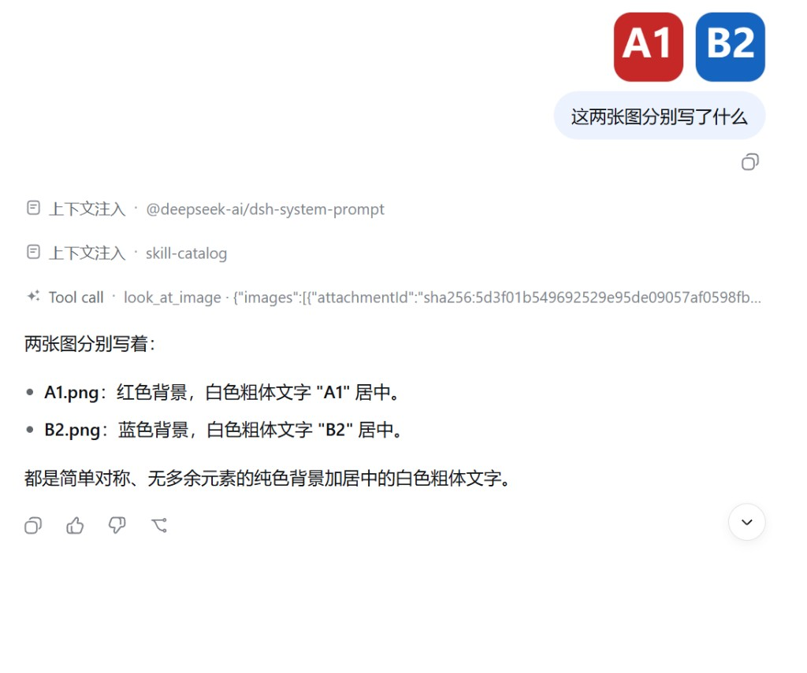
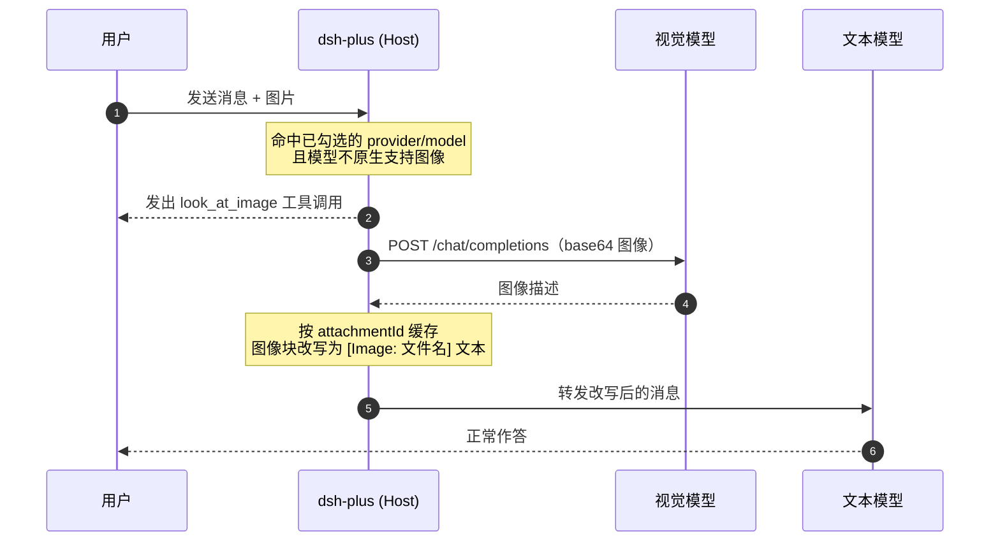
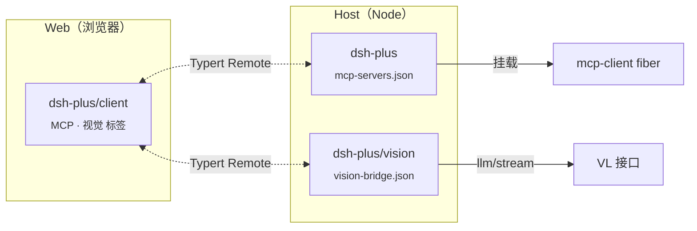

<div align="center">

# dsh-plus

**在 DeepSeek Harness 的「设置 → 插件」里管理 MCP 服务器，并给纯文本模型外挂视觉识图。**

An installable [DeepSeek Harness](https://github.com/deepseek-ai/deepseek-harness) plugin —
MCP catalog in Settings, plus a Vision Bridge that lets text-only models read images in chat.
No fork, no patching the harness.

[](LICENSE)
[](package.json)
[](https://github.com/deepseek-ai/deepseek-harness)
[](#安装)



<sub>贴图 → <code>look_at_image</code> 工具调用 → 原文本模型作答</sub>

</div>

---

## 目录

- [这是什么](#这是什么)
- [特性](#特性)
- [环境要求](#环境要求)
- [安装](#安装)
- [MCP 服务器](#mcp-服务器)
- [视觉桥接](#视觉桥接)
- [工作原理](#工作原理)
- [项目结构](#项目结构)
- [从源码构建](#从源码构建)
- [故障排查](#故障排查)
- [FAQ](#faq)
- [License](#license)

---

## 这是什么

DeepSeek Harness 本身不带 MCP 管理界面，也不会让纯文本模型收图。`dsh-plus` 用官方插件机制补上这两件事：

| 能力 | 你得到什么 |
| --- | --- |
| **MCP 目录** | 设置页里增删改 MCP 服务器，保存即热挂载，无需重启 |
| **视觉桥接** | 给任意 OpenAI 兼容的多模态接口牵一条线，让 DeepSeek 这类文本模型也能"看图" |

两者都以 Host Remote + Web 设置页标签的形式接入，不改动 harness 源码，卸载后不留痕迹。

## 特性

**MCP**

- 支持 **stdio** 与 **Streamable HTTP** 两种传输
- 工具自动进入 `mcp__<服务器名>__<工具名>` 命名空间
- 环境变量、请求头等密钥只存在 Host 侧，页面永不回显
- 与 `cordis` composition 里已声明的服务器共存，来源在列表中区分显示

**视觉**

- 按「提供方 + 模型」逐个勾选，只有你选中的文本模型才会被接管
- 原生支持图像的模型自动跳过，不会重复绕路
- 识图以 **`look_at_image` 工具调用**的形式呈现，和 Curl 一样是一张独立的调用卡片，**不会污染模型自己的思维链**
- 同一张图在会话内只识别一次，结果按 attachment id 缓存

**工程**

- 仓库直接包含构建好的 `lib/`，`dsh plugin add` 无需 `allowBuilds`
- 零运行时依赖（仅 `zod`），harness 相关包全部走 optional peer

## 环境要求

| 项 | 要求 |
| --- | --- |
| DeepSeek Harness | **0.1.0-rc.5** 或兼容版本（`dsh` / `npx @deepseek-ai/dsh`） |
| Node.js | `^22.19.0` 或 `>=24.0.0` |
| 发行版 | **官方发行版**。不要装到已自带 MCP 设置页的改版上 |

> [!WARNING]
> 若目标 harness 已内置 `mcp-settings` 插件，安装本插件会与之冲突。请先确认设置页里没有现成的 MCP 标签。

## 安装

```sh
dsh plugin --profile web add github:7788dev/dsh-plus
dsh web
```

打开 Web UI → **设置 → 插件**，即可看到 **MCP** 和 **视觉** 两个标签。

<details>
<summary><b>只要 Host 能力、不要设置页</b></summary>

用于纯 CLI / headless 场景，只挂载两个 Host Remote，不注入任何前端资源：

```sh
dsh plugin --profile headless add github:7788dev/dsh-plus
```

此时需要手工编辑 `$DSH_HOME/mcp-servers.json` 与 `$DSH_HOME/vision-bridge.json`。

</details>

<details>
<summary><b>卸载</b></summary>

```sh
dsh plugin --profile web remove dsh-plus
```

配置文件不会被删除，重新安装即可恢复。

</details>

## MCP 服务器

**设置 → 插件 → MCP**

| | |
| --- | --- |
| 配置文件 | `$DSH_HOME/mcp-servers.json` |
| 传输方式 | `stdio`、`streamable-http` |
| 服务器名 | `[A-Za-z0-9_-]{1,32}` |
| 工具命名 | `mcp__<serverName>__<tool>` |
| 默认调用超时 | `60000` ms |

保存后，已启用的记录会被立刻挂成 `mcp-client` 子 fiber；列表里的状态列反映 fiber 的真实生命周期（`pending` / `loading` / `active` / `failed`）。

<details>
<summary><b><code>mcp-servers.json</code> 结构</b></summary>

```jsonc
{
  "version": 1,
  "servers": [
    {
      "transport": "stdio",
      "serverName": "filesystem",
      "enabled": true,
      "command": "npx",
      "args": ["-y", "@modelcontextprotocol/server-filesystem", "/data"],
      "env": { "LOG_LEVEL": "info" },
      "cwd": ".",
      "toolCallTimeoutMs": 60000,
      "failOnStartupError": false
    },
    {
      "transport": "streamable-http",
      "serverName": "remote-api",
      "enabled": true,
      "url": "https://example.com/mcp",
      "headers": { "Authorization": "Bearer …" },
      "toolCallTimeoutMs": 60000,
      "failOnStartupError": false
    }
  ]
}
```

| 字段 | 默认值 | 说明 |
| --- | --- | --- |
| `enabled` | `true` | 关闭后保留配置但不挂载 |
| `toolCallTimeoutMs` | `60000` | 单次工具调用超时 |
| `failOnStartupError` | `false` | 为 `true` 时首次连接失败会让整个 fiber 失败 |

`env` 与 `headers` 的**值**不会随快照返回给前端，页面只显示键名。

</details>

## 视觉桥接

**设置 → 插件 → 视觉**

1. 填写多模态 Chat Completions 接口：**Base URL**、**模型 ID**、**API Key**
2. 点 **测试连接**（探测 `GET /models`）
3. 在模型列表里勾选需要收图的**文本模型**——已自带视觉的模型会标注出来并跳过
4. 回到聊天，直接粘贴 PNG / JPEG / WebP / GIF

以硅基流动为例：

| | |
| --- | --- |
| Base URL | `https://api.siliconflow.cn/v1` |
| 模型 | `Qwen/Qwen3-VL-32B-Instruct` |

任何 OpenAI 兼容的 `/chat/completions` 端点都可以，只要支持 `image_url` 内容块。

<details>
<summary><b><code>vision-bridge.json</code> 结构</b></summary>

```jsonc
{
  "version": 1,
  "vision": {
    "baseURL": "https://api.siliconflow.cn/v1",
    "apiKey": "",
    "model": "Qwen/Qwen3-VL-32B-Instruct"
  },
  "targets": [
    { "provider": "your-provider", "model": "your-text-model", "enabled": true }
  ]
}
```

`apiKey` 只写在本机这个文件里。前端快照只返回 `hasApiKey: true/false`，页面留空提交时保留已存的密钥。

</details>

**超时**：单次识图 180 s，连接测试 30 s，`look_at_image` 工具本身 300 s。

## 工作原理

被勾选的模型遇到图片时，Host 在 `llm/stream` 上截住这一轮，先让视觉模型把图写成文字，再把改写后的对话交给原本的文本模型。



几个设计取舍：

- **能力声明**：`resolveModelInfo` 被包了一层，给勾选的模型补上 `image` 输入模态，前端才允许贴图。卸载时自动还原。
- **工具调用而非隐式改写**：识图走真实的 tool call，用户能看见、能展开，且模型自身的 reasoning 通道保持干净。
- **系统提示**：注入一段 `vision-bridge` 说明（order 80），告诉文本模型 `[Image: …]` 块就是用户附件的完整描述，不要自己去调 `look_at_image`。
- **压缩与标题**：`compaction` / `session-title` 这类内部请求直接走改写路径，不额外发工具调用。

## 项目结构



| 入口 | 运行侧 | 作用 |
| --- | --- | --- |
| `dsh-plus` | Host | 读写 `mcp-servers.json`，把已启用的服务器挂成 `mcp-client` |
| `dsh-plus/vision` | Host | 读写 `vision-bridge.json`，声明可收图，注入 `look_at_image` |
| `dsh-plus/client` | Web | 设置页的 MCP / 视觉标签 |

```
src/
├─ client/            # React 设置页（MCP + 视觉两个标签、CSS Modules、中英文案）
├─ host/vision/       # 视觉桥接 Host
│  ├─ index.ts        #   Remote 服务、能力声明、llm/stream 拦截
│  ├─ caption.ts      #   OpenAI 兼容的识图与连接测试
│  ├─ document.ts     #   vision-bridge.json 解析与校验
│  ├─ look-at-tool.ts #   look_at_image 工具定义与调用卡片
│  └─ rewrite.ts      #   消息树里的图像块改写
├─ types.ts           # MCP 公共类型
└─ vision-types.ts    # 视觉公共类型
```

Loader 挂载行见 [`cordis.patch.yml`](cordis.patch.yml)。两个 Host Remote 共用同一个 Typert 包名 `dsh-plus`，浏览器侧只 `$mount` 一次。

## 从源码构建

```sh
pnpm install
pnpm build
```

`tsdown` 产出两个目标：

| 产物 | 来源 | 格式 |
| --- | --- | --- |
| `lib/client.js` | `src/client/index.ts` | CJS / browser，CSS Modules 内联注入 |
| `lib/vision.js` | `src/host/vision/index.ts` | ESM / node |

> [!NOTE]
> `lib/index.js`（MCP Host）和 `lib/typert.*.js` 不由 `pnpm build` 生成，它们是提交进仓库的产物，由 [`scripts/rewrite-typert.mjs`](scripts/rewrite-typert.mjs) 从上游包同步而来。改动 MCP Host 需要重跑该脚本。

`lib/` 随仓库提交，所以 `dsh plugin add github:…` 不需要开启 `allowBuilds`。

## 故障排查

| 现象 | 排查方向 |
| --- | --- |
| 设置页没有 MCP / 视觉标签 | 确认用的是 `--profile web`；headless profile 不注入前端 |
| 提示 `already registered` | harness 自带了 `mcp-settings`，与本插件冲突 |
| 聊天框不让贴图 | 该 provider/model 没在视觉标签里勾选，或视觉接口三项没填全 |
| `识图超时或失败，请再发一次图片` | 视觉接口报错或超时（>180 s）；先用「测试连接」确认端点可达 |
| MCP 服务器一直 `failed` | 检查 `command` 是否在 PATH 中、`cwd` 是否存在；stdio 服务器不经过 shell，参数需逐项拆开写 |
| 工具没出现在模型可用列表 | 服务器可能处于 `active` 但首次 `tools/list` 仍在途中，稍等或重新展开列表 |

## FAQ

<details>
<summary><b>会把我的 API Key 发到浏览器吗？</b></summary>

不会。`mcp-servers.json` 的 `env` / `headers` 值和 `vision-bridge.json` 的 `apiKey` 都只留在 Host。前端快照分别只包含键名和一个布尔的 `hasApiKey`。

</details>

<details>
<summary><b>已经支持图像的模型会被绕一圈吗？</b></summary>

不会。拦截前会用未打补丁的 `resolveModelInfo` 复查一次真实能力，原生支持 `image` 的模型直接放行。

</details>

<details>
<summary><b>同一张图会被反复识别吗？</b></summary>

不会。识图结果按 attachment id 缓存在内存里，同一进程内复用；重启 harness 后缓存清空。

</details>

<details>
<summary><b>可以只用 MCP，不用视觉吗？</b></summary>

可以。两个 Host Remote 相互独立，视觉接口不填就永远不会触发——`baseURL`、`model`、`apiKey` 任一为空即视为未配置。

</details>

## License

[MIT](LICENSE) © 7788dev
